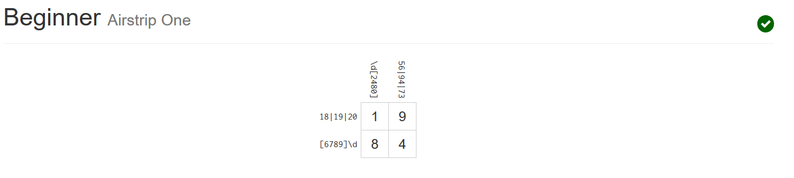
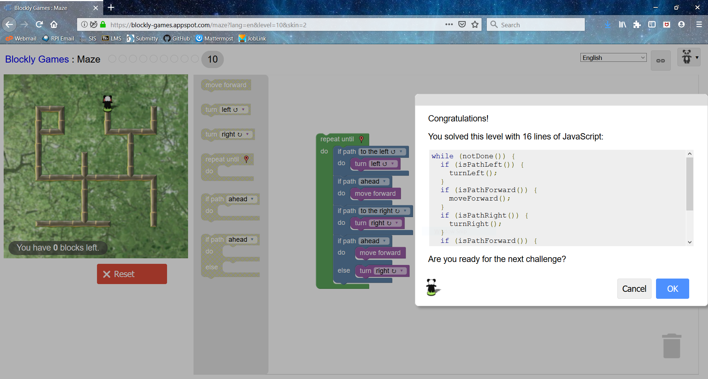

# Lab 1 - Samantha Sprecace

[Github Account](https://github.com/samspre)

[Lab 1](https://github.com/samspre/Open-Source-Software)

## Reading Responses

### How to Answer Questions in a Helpful Way

From my experience, you can also use a calm, level voice and don't take bias regarding their code.  For example, if you see a piece of bad code, but it still does the job decently, don't berate them for it unless it is relevant to the question and/or it is a glaring issue that needs to be fixed ASAP; it might distract them or make them feel worse for not having another piece of working code.

In addition, you can give them sources or more information on how you got to your answer so they can either learn more or look back on it if necessary.

### Free Culture: Catalogs

Upon seeing the title of this chapter, I didn't know what to expect.  What could simple catalogging have to do with piracy?  Turns out, simply building upon a current search engine, and therefore by extension collecting anything that was stored by the previous one, can be considered piracy.  Jesse Jordan learned this the hard way when the RIAA filed a lawsuit against him for "operat\[ing\] a network and had therefore 'willfully' violated copyright laws" (Lessig, 50).  Obviously, Jordan had done nothing of the sort; he had expanded a current engine that happened to contain pirated music courtesy of *other* students.  As a result, he was given a choice: "$250,000 and a chance at winning,
or $12,000 and a settlement" (52).  Jordan made the latter choice, and I realized that even though something is considered open source, it can still be claim as someone's own through backends and loopholes.

## Exercises

Partial Tree Directory


Regex Practice


Regex Puzzles




Blockly

``` javascript
while (notDone()) {
  if (isPathLeft()) {
    turnLeft();
  }
  if (isPathForward()) {
    moveForward();
  }
  if (isPathRight()) {
    turnRight();
  }
  if (isPathForward()) {
    moveForward();
  } else {
    turnRight();
  }
}
```



## Reflection

The RCOS project "codeBuddy" looks like something I definitely would be interested to work on.  Considering I'm using Atom for this class as well as others, I would like to be able to help with improvements for it, as well as the fact that searching for the same algorithm multiple times over is very tedious and can be automated.
