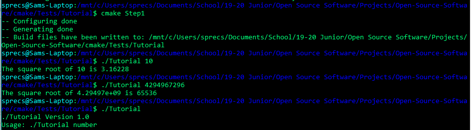

# Part 1: Tutorial

##### Step 1

##### Step 2

##### Step 4

##### Step 5

# Part 2: Custom Makefile

[My Makefile](build/myMakefile)

[CMake Makefile](build/Makefile)

[CMakeLists](build/CMakeLists.txt)

Results

##### Sizes
Dynamic: 8600

Static: 8784

