# Lab 6: Using Docker

### Example 0
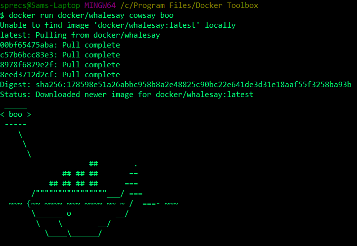

### Example 1
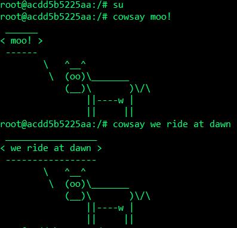

### Example 2
#### Running Containers
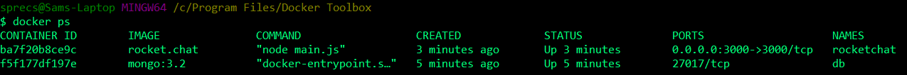

#### Images
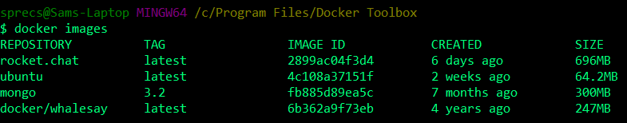

#### Misc.
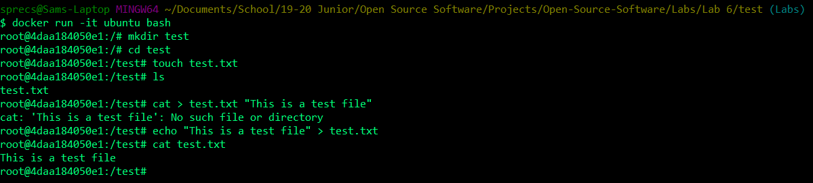

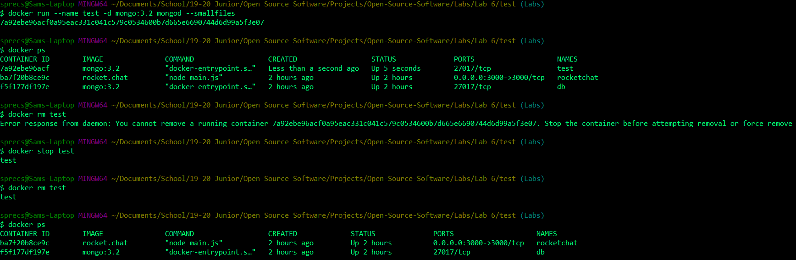

Connection refusals, cant access anything but port 5000 (see last image)

### Example 3
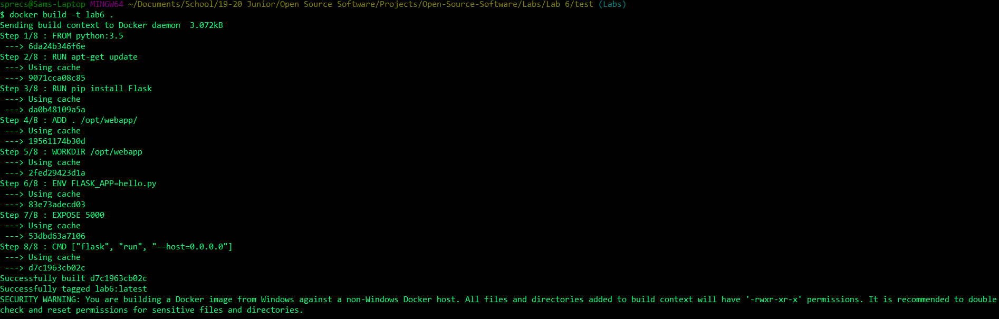

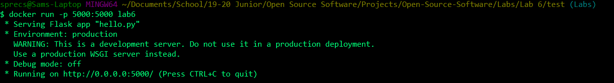

Note: localhost does not work, need to use IP that Docker initially connects to (in my case, it is 192.168.99.100)

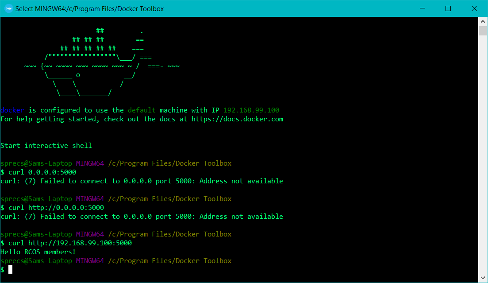

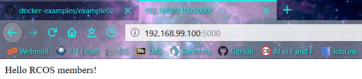

### Example 4
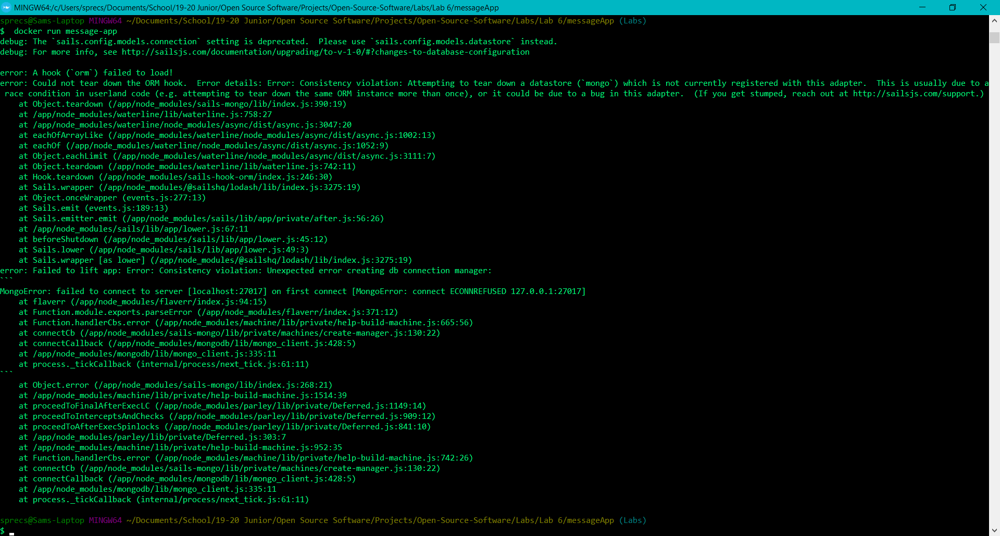

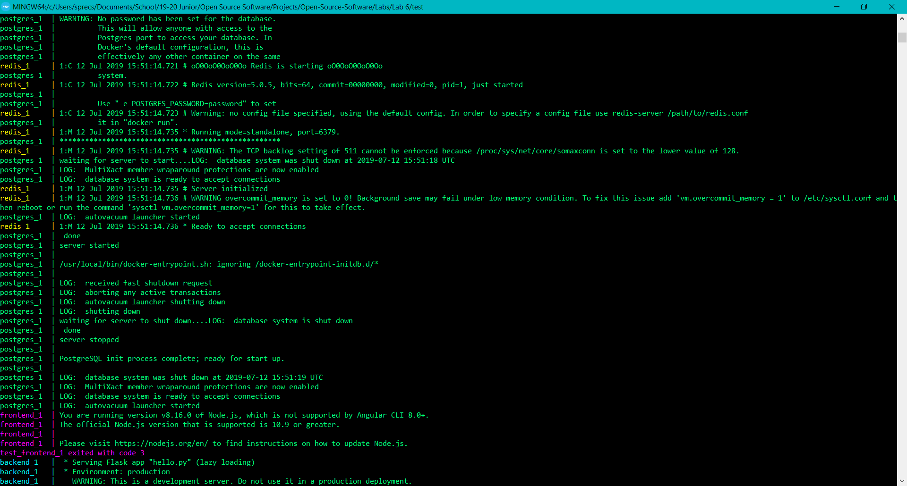

Note: localhost does not work again, need to use host IP

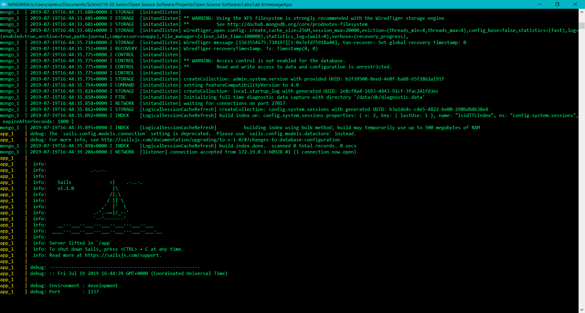

#### Backend
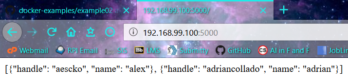

#### Frontend

Connection refusals, cant access anything but port 5000

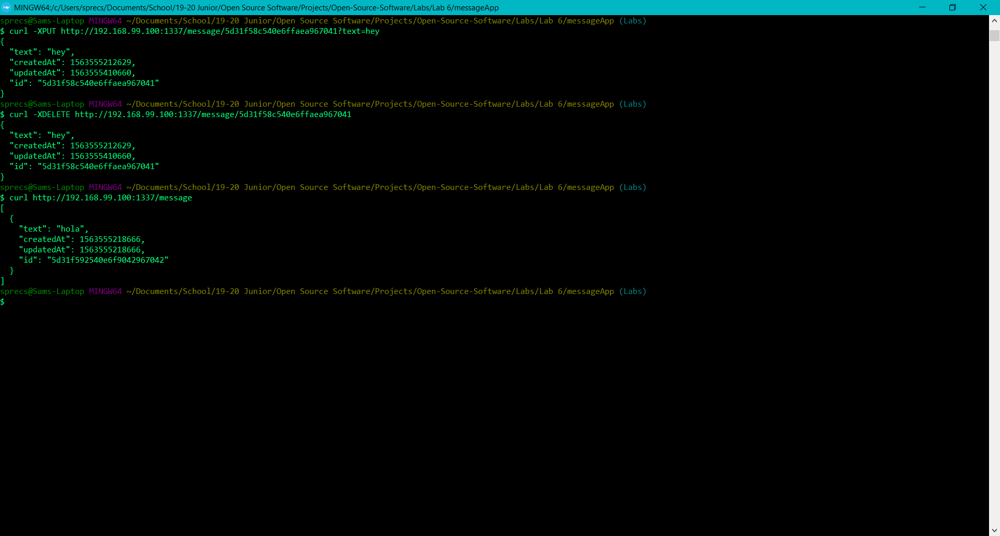
