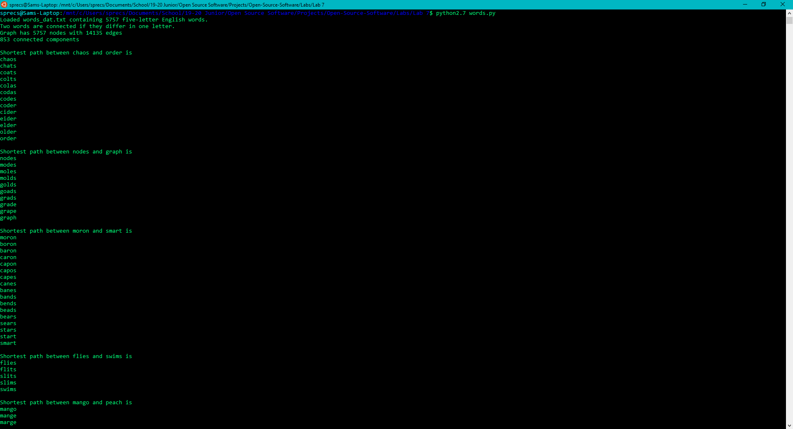

# Lab 7: Scientific Computing

#### 5-letter Pairs




#### 4-letter Pairs
Had to change the input file to ```words4_dat.txt.gz``` from ```words_dat.txt.gz```, word size to [0:4] from [0:5], and change the words we're looking for in main

``` python
# Added to words_graph()
w = str(line[0:4])

# Modified main
for (source, target) in [('cold', 'warm'),
                         ('love', 'hate'),
                         ('good', 'evil'),
                         ('pear', 'beef'),
                         ('make', 'take')]:
    print("\nShortest path between %s and %s is" % (source, target))
    try:
        sp = nx.shortest_path(G, source, target)
        for n in sp:
            print(n)
    except nx.NetworkXNoPath:
        print("None")
```


#### Using Permutations
Added/modified code in ```words.py```

``` python
for cc in lowercase[j + 1:]:
    for ccc in perm(left + cc + right):
        s = ''
        yield s.join(ccc)
```

