# Lab 8: Data Science

#### Data Visualization with ggplot2 Part 1

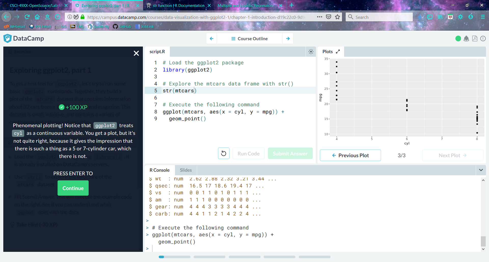
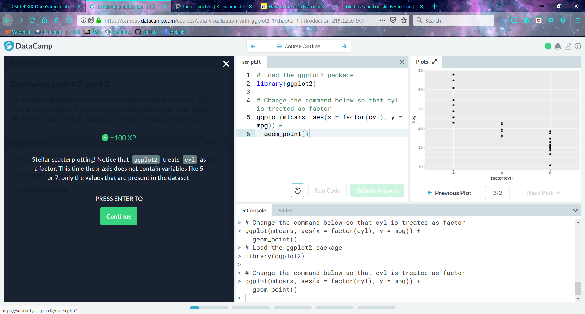
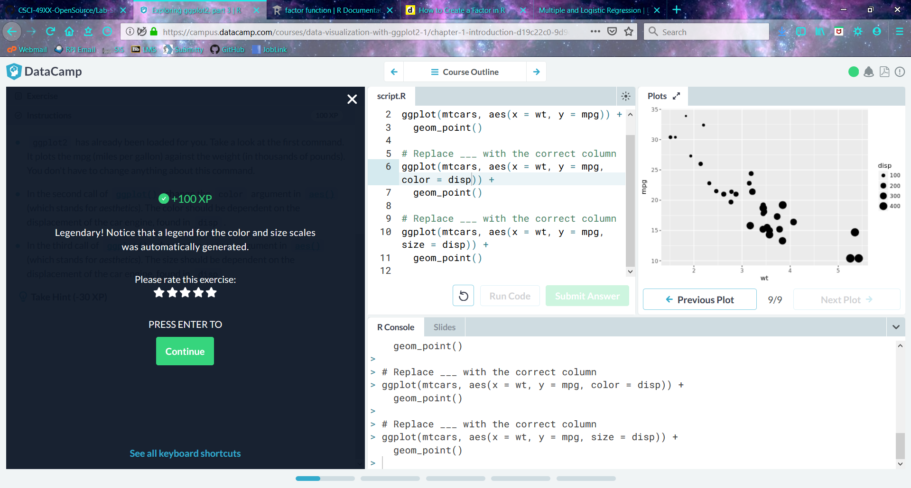
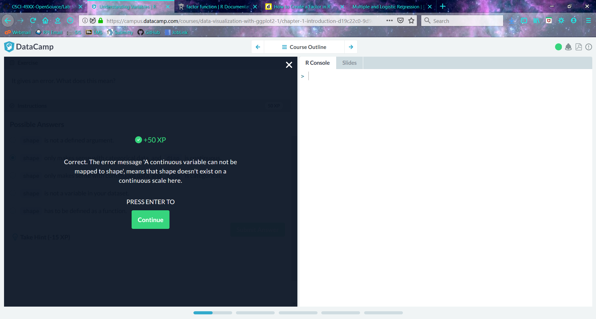
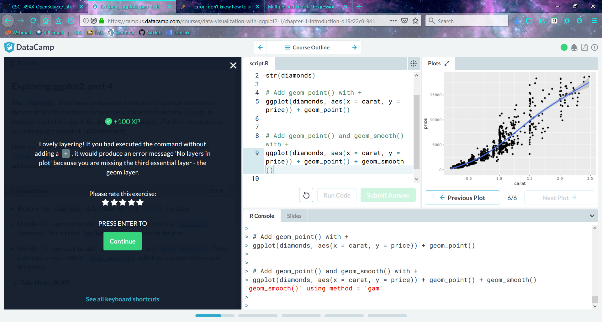
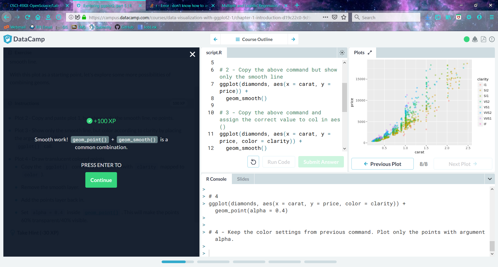
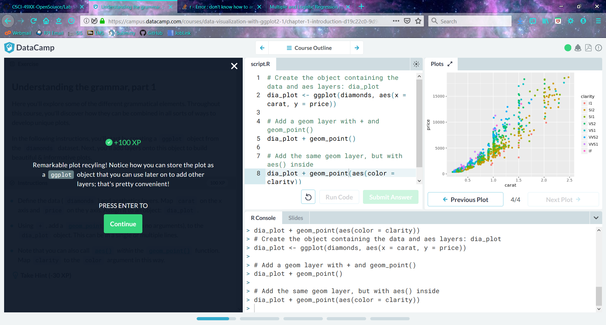
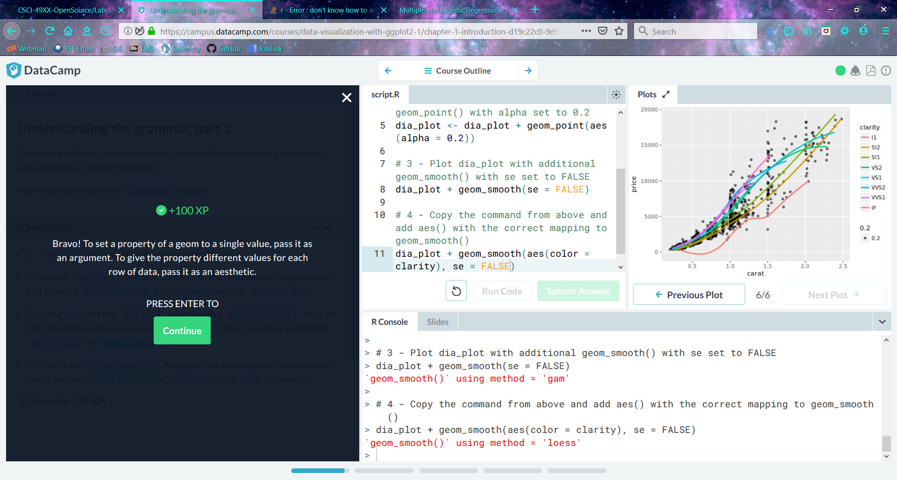
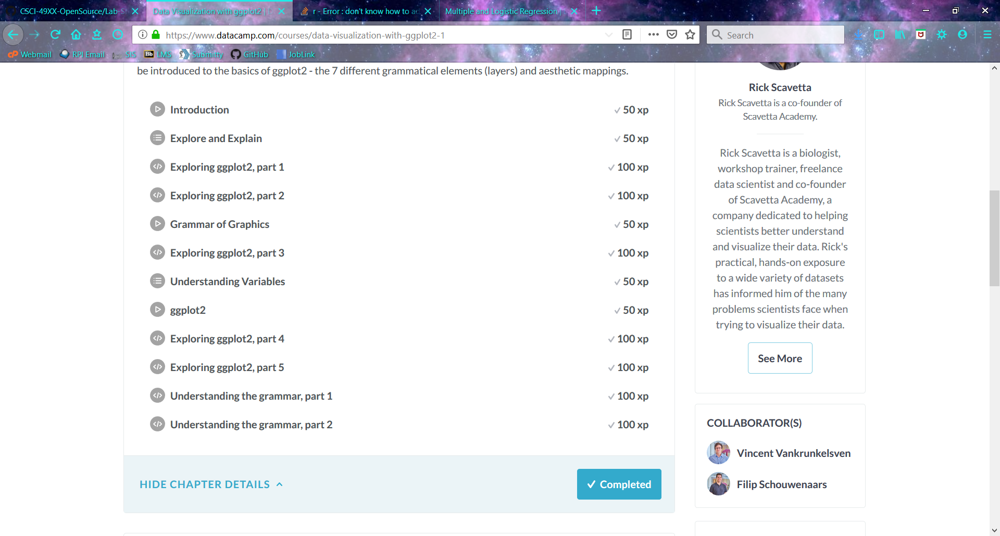

#### Multiple and Logistic Regression - Parallel Slopes

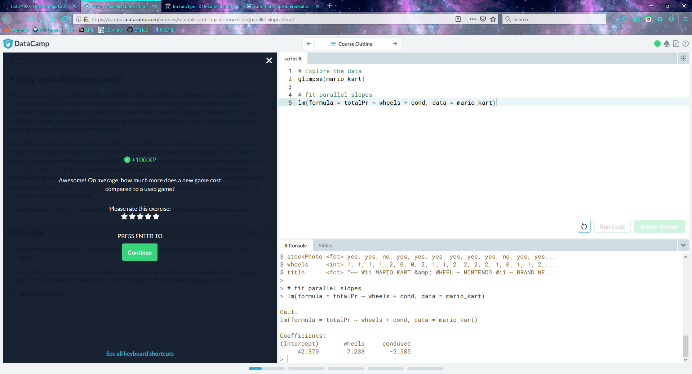
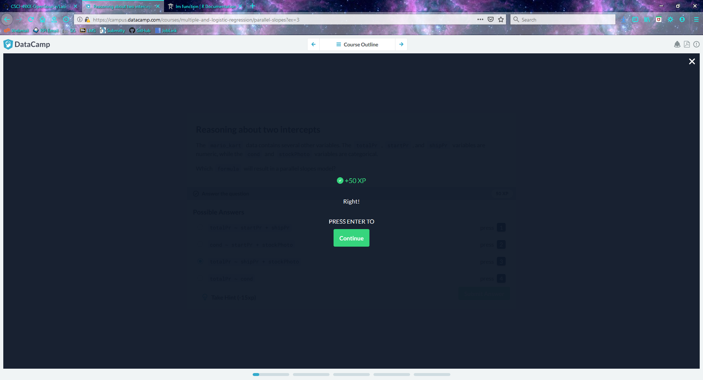
##### Got stuck on this one because of wording
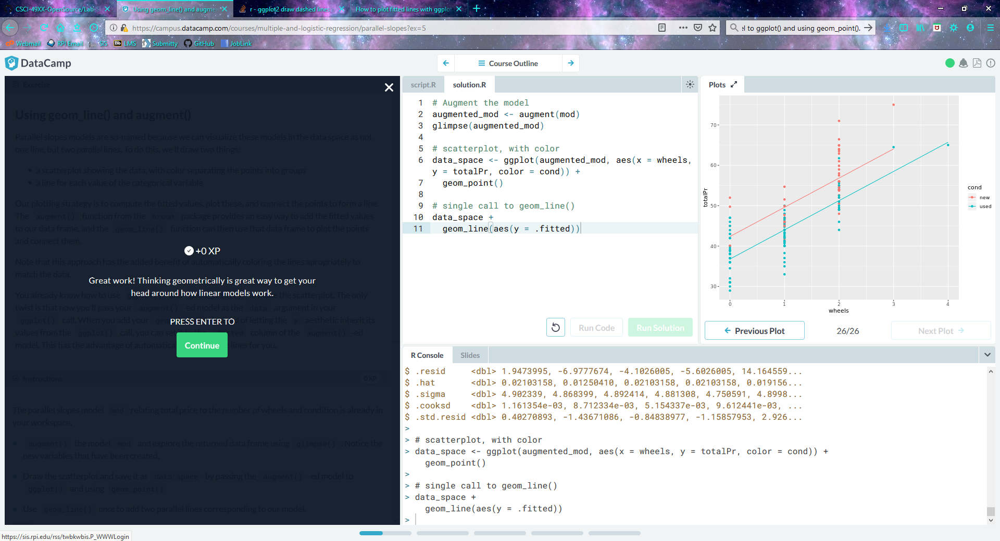
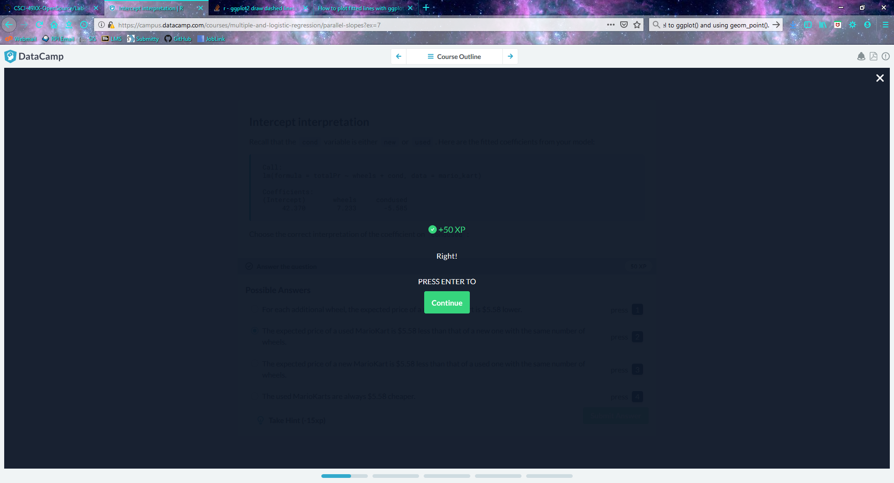
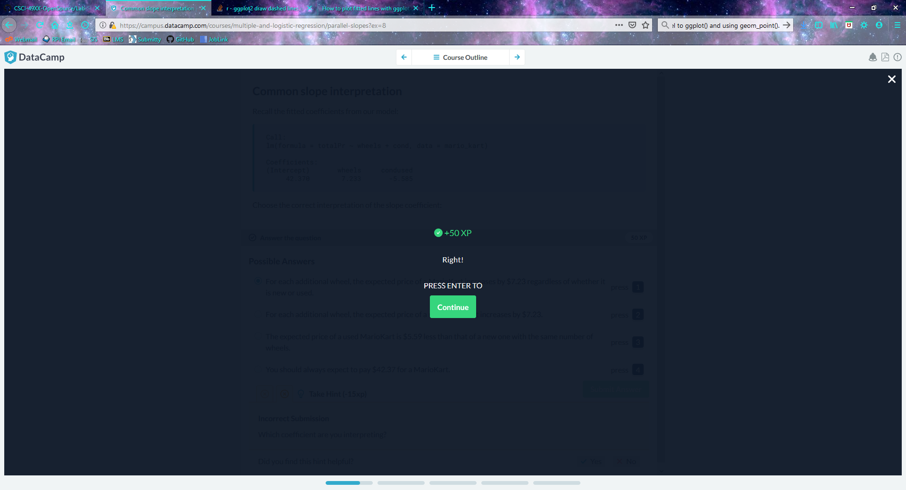
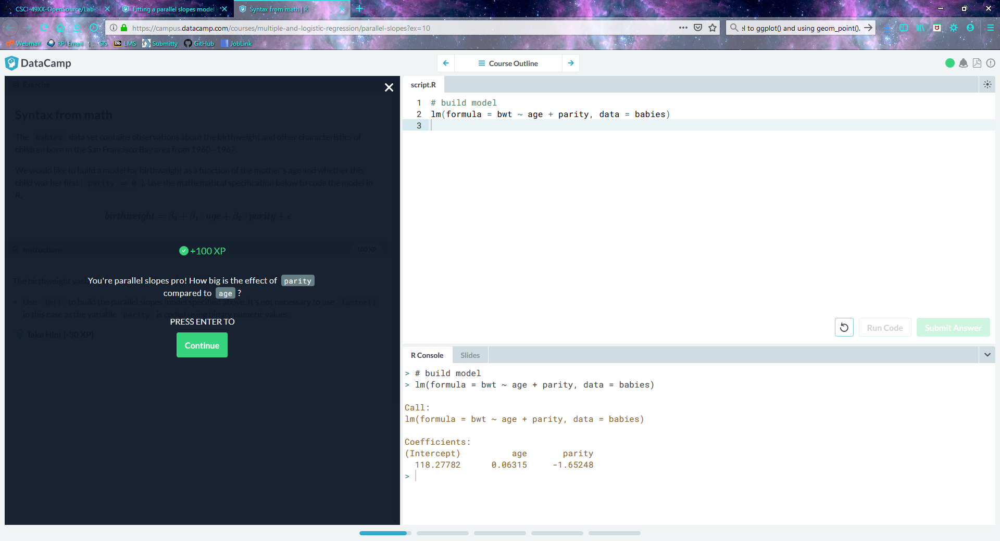
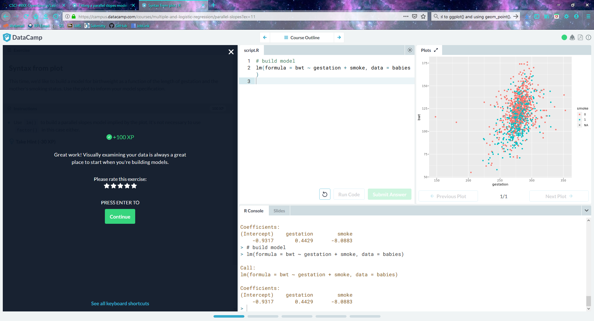

Note: Some quiz answers I got intially incorrect

#### RCOS Link
[Observatory Link](https://rcos.io/projects/samspre/web-systems-development-group-6/profile)
