# Lab 9 - TensorFlow

#### Check 1: Graph
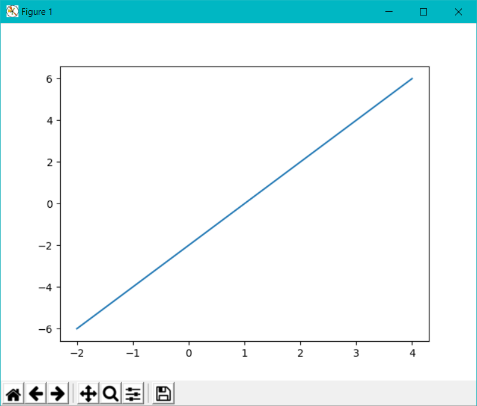

#### Check 2: TensorFlow Classification for 9000-9014

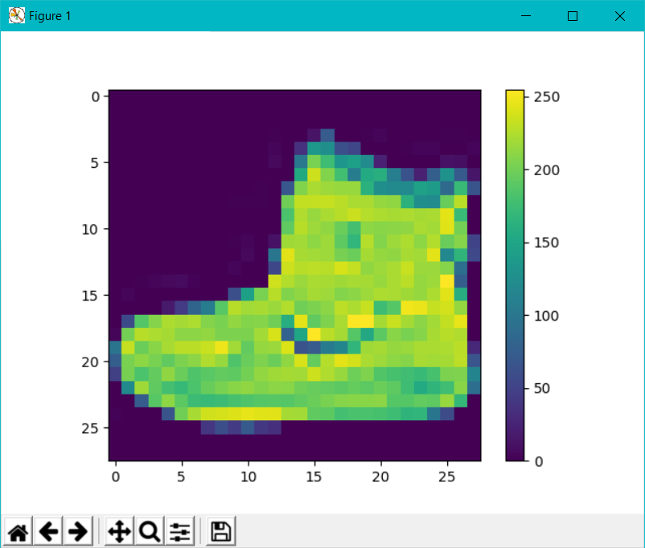

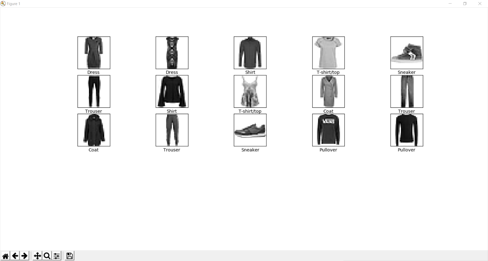

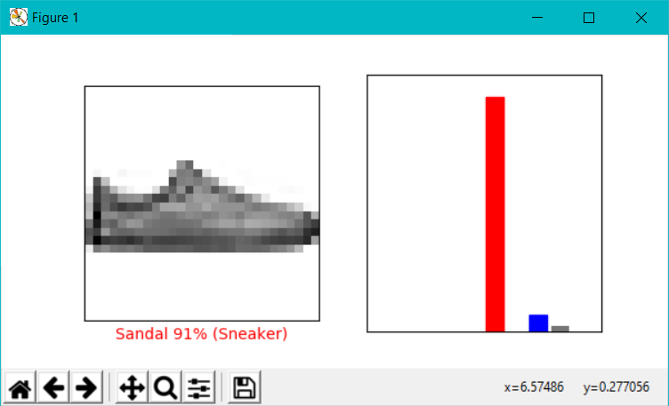

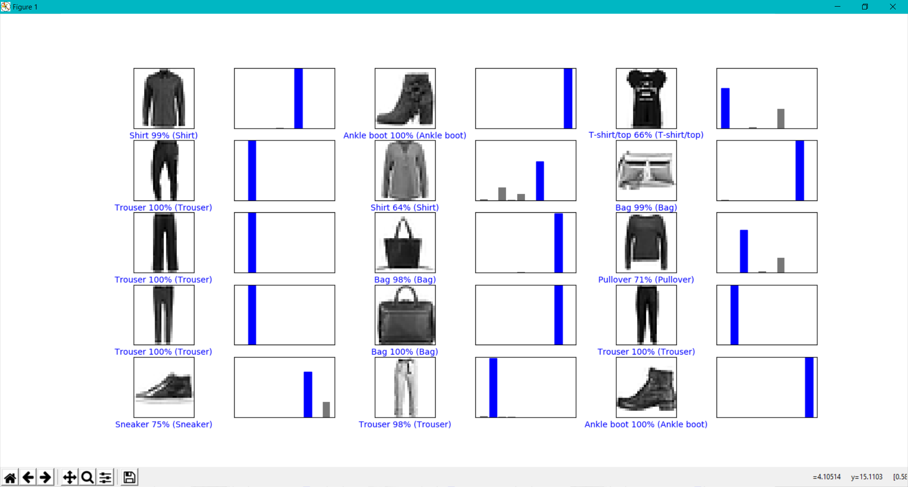

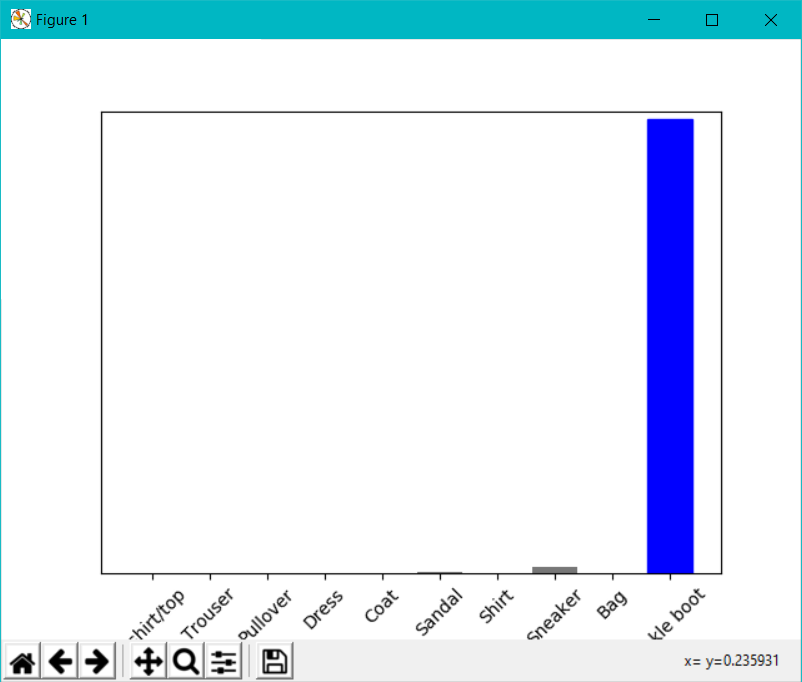

Test Results
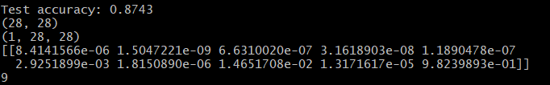

#### Check 3: Image Data Curation

##### Original Images

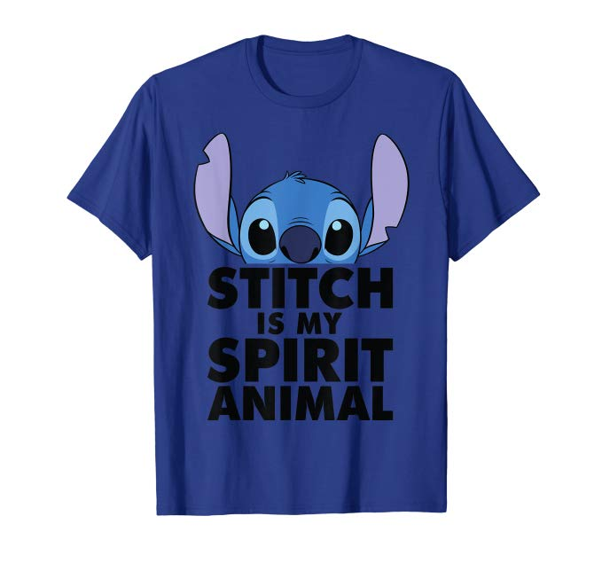

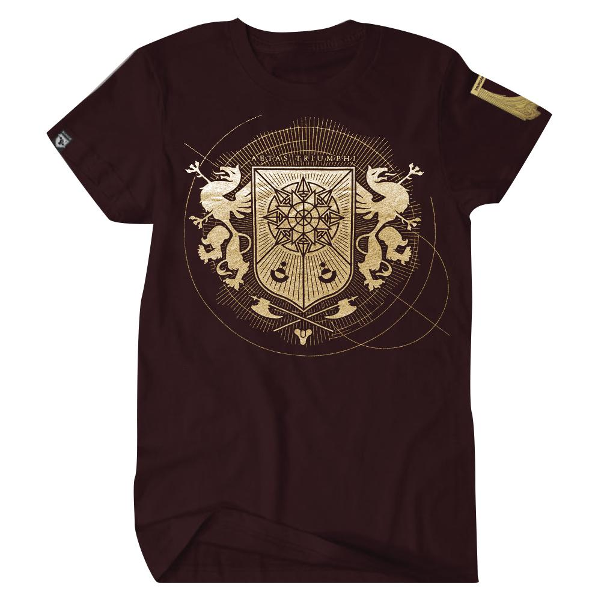

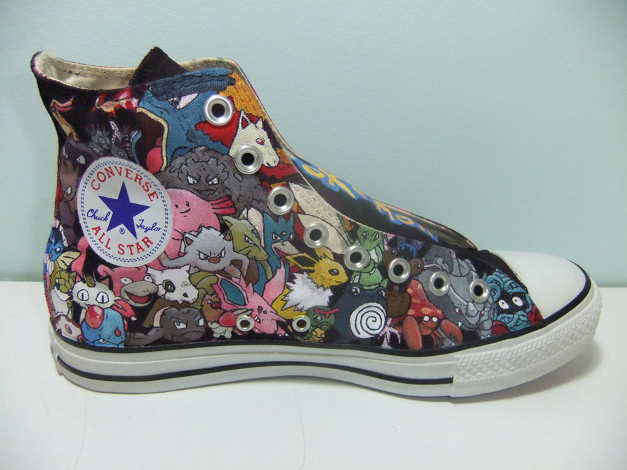

##### Processed Images

Shirt 1
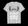

Shirt 2
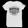

Shoes
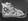

##### Results

Note: There were a ton of bugs I couldn't really figure out trying to do this, such as the fact that it no longer prints the images below (I can't figure out the bugs) and that it is not totally accurate in its predictions.  I picked the closest ones out of my tests

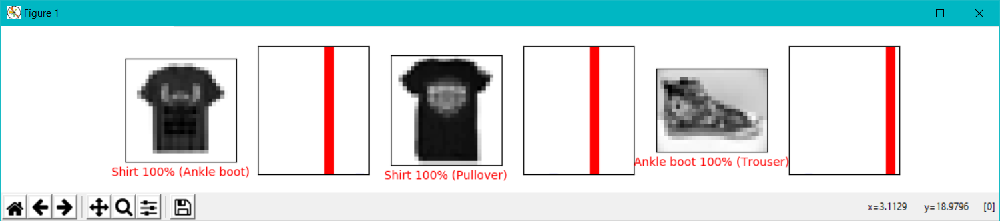

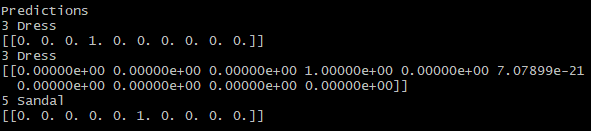
